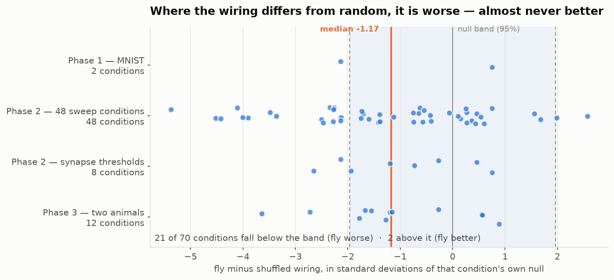
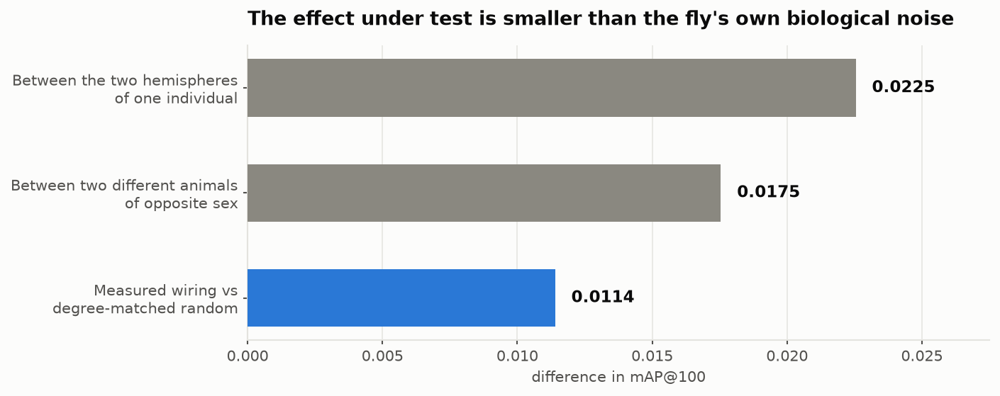
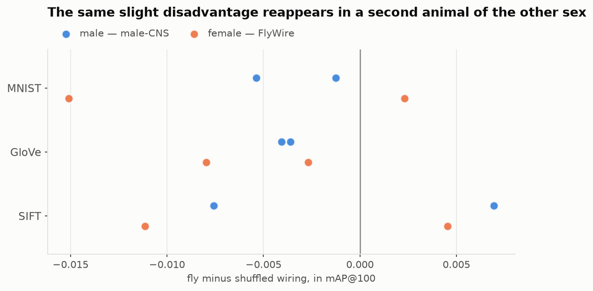
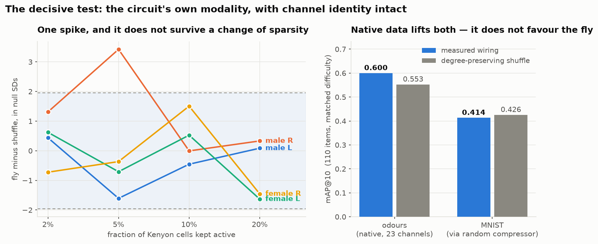
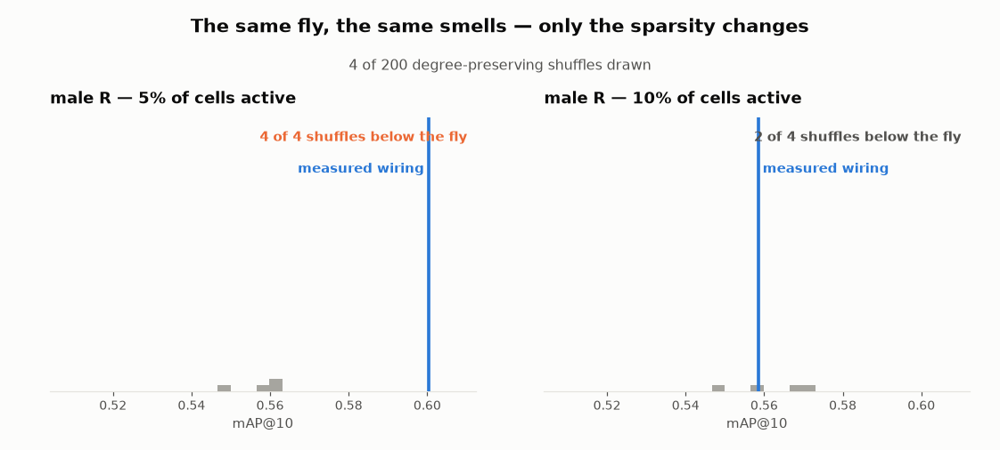
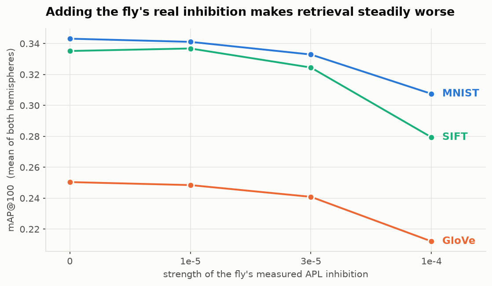

# FlyHash on measured wiring

**Does the measured wiring of a fruit fly's mushroom body hash data better than a random rewiring of itself?**

Short answer: **no** — in a static, rate-based model of the kind the claim under test is itself built on. Where it differs, it is very slightly *worse*.

This repository tests a well-known claim from neuroscience against two real connectomes, with the evaluation criteria fixed in writing before the first run. The result is negative, reproduced in a second animal of the other sex, and small enough to be swamped by the difference between one fly's own left and right brain hemispheres.

---

## The claim being tested

In 2017, [Dasgupta, Stevens & Navlakha](https://www.science.org/doi/10.1126/science.aam9868) showed in *Science* that the fruit fly's olfactory circuit implements a **locality-sensitive hash** — an algorithm for finding similar items quickly.

The circuit works like this. About 50 input channels (glomeruli) feed ~150 projection neurons, which fan out onto a few thousand **Kenyon cells**. Each Kenyon cell samples roughly 6 projection neurons. A single giant inhibitory neuron, **APL**, then silences all but the most excited few percent. What survives is a sparse binary code — and similar smells produce similar codes.

That paper called the trick **FlyHash** and showed it beats classical LSH at nearest-neighbour search.

But it used an *idealised* circuit: a uniformly random sparse matrix, exactly 6 inputs per cell, and an abstract "keep the top k" operator standing in for APL.

Since then, complete connectomes have been published. So the obvious question:

> **The real wiring is not uniformly random. Does its actual structure — which specific projection neuron connects to which Kenyon cell — hash better than a random rewiring with the same degree structure?**

If evolution tuned those partner choices for anything like similarity search, it should show.

---

## The answer

<p align="center">
  
</p>

Across **86 conditions** — four synapse thresholds, four datasets including the fly's own odour repertoire, two input granularities, four hash lengths, four inhibition strengths, two animals — the measured wiring landed *below* its own null distribution far more often than above. It fell below the band **21 times** and above it **3**; the median sits 0.73 standard deviations on the wrong side of zero.

The effect is real but tiny, and the right way to see how tiny is to measure it against the fly's own biology:

<p align="center">
  
</p>

A fly's left and right mushroom bodies are two copies of one genetic program, grown in the same head from the same genome. **They differ from each other more than the real wiring differs from a random rewiring of itself.**

So whatever the specific PN→KC partner choices are for, this model cannot see them helping nearest-neighbour retrieval. That is a statement about this wiring diagram under this model — not about what the living circuit does.

---

## Why the answer is trustworthy

A negative result is only as good as its controls. Four things carry the weight here.

**1. The right null model.** The obvious comparison — real wiring versus uniform random — conflates two things. Real Kenyon cells have an *uneven* number of inputs (from 2 to 13), which could be a by-product of how brains grow rather than an adaptation. So the primary control is a **degree-preserving shuffle**: the graph is rewired at random while every cell keeps its exact input count and every projection neuron keeps its exact target count. Only the pairing changes. That isolates "which partner" from "how many".

The shuffle was verified to reach equilibrium, not merely to look shuffled: overlap with the original plateaus at 0.090 from 10 swaps per edge through 400, and the configuration-model expectation computed from the degree sequences is **0.0906**. An exact match.

**2. Pre-registration.** Because the expected result was null, every evaluation parameter — metric, hash length, neighbour count, shuffle count, significance rule — was written into the [spec](docs/spec.md) before the first run and never changed afterwards. Where the code later turned out to contradict the spec, the deviation is [recorded](docs/FINDINGS.md), not quietly fixed.

**3. A biological yardstick.** Comparing the effect to a p-value only says whether it is detectable. Comparing it to the left-right difference within one animal says whether it *matters*. It does not.

**4. Replication in a second animal.**

<p align="center">
  
</p>

The whole pipeline was re-run on the [FlyWire](https://flywire.ai/) **female** brain, reconstructed by a different laboratory (Princeton) from a different electron-microscopy volume. Zero conditions favoured the fly in either animal.

This required care: FlyWire's published connection table is effectively thresholded at 5 synapses per pair, while the male dataset was processed at 3. Comparing them directly would have **confounded sex with the edge-inclusion criterion** and produced what looked like a biological difference. The male is therefore compared at a matched threshold of 5.

---

## Closing the biggest hole: testing it on smells

Everything above — and the 2017 paper too — pushes images or word vectors through an *olfactory* circuit using a random compressor. That compressor is a problem nobody had named:

> After a random projection from 784 pixels to 149 projection neurons, **neuron #37 carries a random mixture of every pixel and means nothing.** If the real wiring says "this Kenyon cell samples glomeruli DA1, VA1v and DM1 because those odours co-occur," that structure is meaningless once the channels are scrambled — and a shuffle cannot destroy what is already destroyed.

So the experiment was structurally incapable of detecting wiring tuned to specific input channels. The comparison stayed fair, but a whole region where the effect could live had been cut out of it.

**So we ran it on the circuit's actual job.** Real odour responses — [Hallem & Carlson 2006](https://www.cell.com/fulltext/S0092-8674(06)00363-1), 110 odorants against 24 receptors — with the mapping kept exact: receptor Or22a feeds glomerulus DM2, which feeds the projection neurons the connectome calls DM2. No compressor. All 23 unambiguous channels are present in all four hemispheres of both animals.

<p align="center">
  
</p>

<p align="center">
  
</p>

The animation is the study's whole method in one loop. Degree-preserving shuffles accumulate into the null distribution while the measured wiring's score stays fixed. On the left it looks like a discovery; on the right — same fly, same smells, one dial moved — it is nothing.

Of 16 conditions, exactly one reaches significance: the male right hemisphere at 5% sparsity, where **all 200 of 200 shuffles score below the fly** (z = +3.42). It looks like a discovery until you move one dial — at 10% sparsity the same hemisphere scores **z = −0.00**, and the same animal's left hemisphere runs negative throughout. A real advantage in wiring does not evaporate because you changed the sparsity from 5% to 10%.

Native data *does* matter for performance — at matched difficulty it lifts mAP from 0.41 to 0.60 — but it lifts the degree-preserving shuffle just as much. **Modality changes how well the circuit works; it does not change whether the real wiring beats random.**

This is the strongest form of the result. The obvious objection to any negative finding here — *you fed it the wrong data through the wrong door* — no longer applies.

---

## The wiring *is* structured — just not for this

The natural objection to all of the above is that a static model is the wrong instrument, so a null says nothing. That objection cannot be tested head-on: no public dataset gives odorant-by-glomerulus spike latencies, without which coincidence detection cannot be modelled honestly.

So the question was reframed to need neither the task nor the dynamics. **Do Kenyon cells sample glomeruli in a pattern a degree-preserving shuffle would not produce?** That is about the wiring alone.

They do, in **all four hemispheres of both animals**, under two correlation measures, against a shuffle that preserves each cell's exact number of measured inputs (z = +2.3 to +4.5). The strongest motif, DM2–DM4, is among the top three pairs in every hemisphere: 61–72 cells sample that pair together where 34–46 are expected. Both glomeruli carry fruit esters. The pheromone pair VA1v–VA1d is strong in the male (z ≈ +6) and weak in the female — suggestive of sexual dimorphism, though two animals is not a sample.

But the structure is **not** "wire correlated inputs together": that correlation is only r ≈ 0.09. And its direction is the opposite of what efficient coding predicts — cells pool inputs that respond *alike*, raising redundancy rather than decorrelating.

Which resolves the apparent contradiction. The wiring is tuned, measurably. It is simply not tuned for nearest-neighbour retrieval, and a benchmark built on response statistics cannot see a structure organised by something else. That is a limitation of the question, not only of the model.

---

## A side result worth its own plot

The 2017 model replaced APL with an abstract "keep the top k". The real APL contacts every Kenyon cell but with synapse counts spanning 6 to 160. Substituting that measured inhibition in:

<p align="center">
  
</p>

Retrieval gets monotonically **worse**, on every dataset, in both hemispheres.

The honest interpretation is narrow: in a real fly, APL *creates* the sparsity, whereas here it perturbs a selection that was already made. This says the graded inhibition does not help *this* model — not that APL is useless.

---

## So what is any of this good for?

Fair question for a negative result. Four things.

### 1. It is good news for anyone who wants to *use* FlyHash

FlyHash works. On MNIST it reaches mAP@100 of 0.36 with a 93-bit sparse code. This project does not challenge that — it challenges the idea that you need a connectome to get it.

Since degree-matched random wiring performs **as well or better** than the measured wiring, you can:

- build the projection matrix with a random number generator, no connectome download, no cell-type parsing;
- choose your own dimensions freely, instead of being stuck with the fly's 150 → 2000;
- stop treating "biologically faithful" as a quality signal for this algorithm.

That is a practical licence to simplify. The idealised model in the paper is not an approximation you are settling for; it is at least as good as the real thing.

So the library in this repository ships **random wiring by default** — not as a shortcut, but as the conclusion:

```python
from flyhash.hash import SimilaritySearch, FlyHasher, find_duplicates

index = SimilaritySearch.build(vectors)          # 784 inputs -> 15680 cells, 784 active
neighbours, overlap = index.query(queries, k=10)  # ~1.6 ms per query

find_duplicates(vectors, threshold=0.9)           # (i, j, similarity) triples

FlyHasher.random(n_inputs=300, n_cells=4000, n_claws=6, sparsity=0.05)
FlyHasher.from_circuit(circuit)                   # the measured wiring, for reproduction only
```

On 5000 MNIST digits that reaches **recall@10 of 0.62** against exact search, at 1.6 ms per query. `from_circuit` exists so the comparison in this repository can be reproduced — it is not the recommended way to build a hasher.

### 2. A reusable method for "is this circuit special?"

The interesting reusable asset is not the answer, it is the machinery. Connectomics keeps producing claims of the form *"this circuit is wired for X"*, and they are usually argued from anatomy alone. The pattern here is transferable to any of them:

- **a degree-preserving shuffle** as the null, so degree structure cannot masquerade as design;
- **the two hemispheres of one animal** as a free, built-in noise floor — two independent instantiations of the same genetic program, needing no extra specimen. Most connectome analyses have this control sitting unused in their own data;
- **a second animal** for replication, now that multiple connectomes share a cell-type nomenclature;
- **pre-registration**, because null expectations are exactly where post-hoc tuning does its damage.

The hemisphere yardstick is the cheapest and, I would argue, the most underused. It converts "p < 0.05" into "bigger or smaller than the animal's own developmental noise" — a far more useful question.

### 3. Working, tested infrastructure for two connectomes

[`src/flyhash/`](src/flyhash/) turns 1 GB of raw connectome into a few-megabyte sparse circuit, with the same interface for both datasets:

```python
from flyhash.circuit import Circuit
from flyhash.glomeruli import aggregate_by_glomerulus

male   = Circuit.load("data/circuit.npz")            # Janelia male CNS
female = Circuit.load("data/circuit-flywire.npz")    # FlyWire female brain

left = female.hemisphere("L")
by_glomerulus, names = aggregate_by_glomerulus(left)  # same code, either animal
```

The extracted circuits are **committed to this repository**, so the analysis reproduces without downloading anything. 90 tests cover the pipeline.

### 4. A calibrated negative to build on

Knowing the size of the *absence* is useful. Any future claim that connectome structure improves a hashing or retrieval task now has a bar to clear: it must beat a degree-preserving shuffle by more than one animal's hemisphere asymmetry. This repository provides that bar, the code to measure it, and the numbers.

---

## What this does **not** show

- **Not** that FlyHash fails. It works; it just does not need the real wiring.
- **Not** that the mushroom body is unstructured. It is measured against *one* task. Partner choice may well be tuned for odour discrimination, learning, or valence assignment — none of which this tests.
- **Not** a refutation of the 2017 paper's FlyHash-versus-LSH comparison. The "LSH" baseline here is a dense Gaussian projection through the same top-k sparsification, **not** the sign-bit Hamming LSH of the literature. That comparison is untested here, in either direction.
- **Not** a full olfactory test. The odour experiment uses 23 of the fly's ~50 glomeruli and a database of only 110 odorants — the entire published set, but two orders of magnitude smaller than the other benchmarks.
- **Not** a simulation of a fly. The model is static and rate-based: no spike timing, no membrane time constants, no adaptation, and APL as a one-shot selection rather than a continuous feedback loop. Kenyon cells are coincidence detectors in life, and that is absent here. A signal pushed through a bare adjacency matrix is not the behaviour of the animal — a limitation this field has known since Bargmann & Marder. Note, though, that the hypothesis under test is itself a static algorithm, so it is tested in its own terms, and that both arms of every comparison run through the identical model.
- **Not** independent evidence 86 times over. The conditions share a circuit, a compression matrix and a dataset; they are one property measured repeatedly.

Every deviation from the pre-registered plan is listed in [FINDINGS.md](docs/FINDINGS.md) — including a Euclidean ground truth where cosine was specified for GloVe, and a mean-normalisation step that is pathological on GloVe vectors (4815 of 10000 have a negative mean and get sign-flipped).

---

## Reproducing

```bash
pip install -e ".[dev,figures]"
python -m pytest                      # 90 tests
```

The extracted circuits are committed, so the analyses run directly:

```bash
python -m flyhash.phase1              # ~11 min — the core comparison, MNIST
python -m flyhash.phase2              # ~75 min — 48 robustness conditions
python -m flyhash.phase3              # ~20 min — male versus female
python scripts/threshold_sweep.py     # ~15 min — synapse-weight thresholds
python scripts/odour_experiment.py    # ~3 min  — the fly's own modality
python scripts/wiring_structure.py    # ~4 min  — is the wiring structured at all?
python scripts/make_figures.py        # the figures above
python scripts/make_gif.py            # the animation
```

Timings are from one desktop machine; they scale with the number of shuffles, which every runner exposes as `--shuffles`.

Benchmark data (MNIST, GloVe, SIFT) downloads on first use into `data/datasets/`.

To rebuild the circuits from raw connectome data, fetch the source files into `data/raw/` and run `python -m flyhash.extract` and `python -m flyhash.flywire`. Every run is seeded; both sweeps were executed twice from separate processes and produced bit-identical numbers.

---

## Layout

| Path | What it holds |
|---|---|
| `src/flyhash/circuit.py` | the `Circuit` container both datasets load into |
| `src/flyhash/extract.py` | streams the 1 GB male connectome into a circuit |
| `src/flyhash/flywire.py` | the same, for FlyWire's female brain |
| `src/flyhash/models.py` | the five projection models, including the degree-preserving shuffle |
| `src/flyhash/encode.py` | normalise → compress → project → winner-take-all |
| `src/flyhash/bench.py` | exact ground truth and mAP@100 |
| `src/flyhash/hash.py` | the library: encode, similarity search, duplicate finding |
| `src/flyhash/phase1/2/3.py` | the three experiments |
| `scripts/odour_experiment.py` | the native-odour test, with channel identity preserved |
| `scripts/wiring_structure.py` | structure test needing neither task nor dynamics |
| `results/` | every number reported here |
| `docs/spec.md` | the pre-registered design, written before any run |
| `docs/FINDINGS.md` | results, deviations and caveats in full |
| `docs/plans/` | the implementation plans for each phase |

---

## Data sources and licence

| Dataset | Animal | Source | Licence |
|---|---|---|---|
| male-CNS v1.0 | male, whole central nervous system | [Janelia FlyEM](https://male-cns.janelia.org/download/) | CC-BY 4.0 |
| FAFB v783 | female, brain | [FlyWire](https://codex.flywire.ai/) | CC-BY-NC 4.0 |
| Odorant responses | 110 odorants x 24 receptors | Hallem & Carlson 2006, *Cell* 125:143, via the [DoOR database](https://neuro.uni-konstanz.de/DoOR/) ([ropensci/DoOR.data](https://github.com/ropensci/DoOR.data)) | see DoOR |

Both are the work of large collaborations and must be cited accordingly — see [FlyWire's citation guidance](https://codex.flywire.ai/about_flywire) and the Janelia download page.

**The two licences differ in an important way.** FlyWire's CC-BY-NC terms **prohibit commercial use**; the male-CNS data carries no such restriction. Anything derived from the FlyWire half of this work inherits the non-commercial condition — including the committed `data/circuit-flywire.npz` and the Phase 3 results. Check [FlyWire's terms](https://flywire.ai/tos) before building on it.

Code in this repository is MIT licensed (see [LICENSE](LICENSE)). The committed `.npz` circuits are derived data and inherit the terms of their respective sources.
